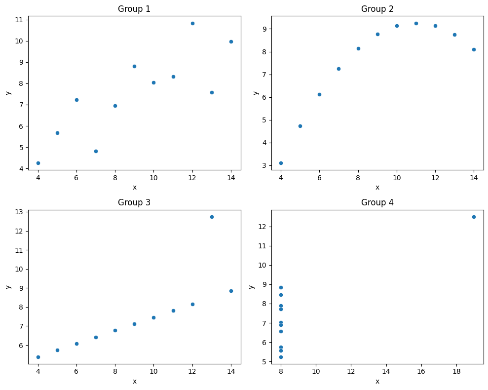

# Universidad Politécnica Salesiana  
## Carrera: Ingeniería en Ciencias de la Computación  
### Periodo: 2025-2026 - 67 
**Estudiante:** Jorge Márquez 

df_anscombe

https://colab.research.google.com/drive/1m2a-J8gG1QcWPJHrQM9yIkwNK52SOTC6?usp=sharing

### Introducción Teórica

El **Cuarteto de Anscombe** (Anscombe, 1973) es un conjunto de cuatro grupos de datos que tienen estadísticas casi idénticas — medias, desviaciones estándar, correlaciones y ecuaciones de regresión — pero distribuciones gráficas completamente diferentes.

Su propósito es demostrar que los **resúmenes numéricos pueden ser engañosos si no se visualizan los datos**. Este principio es fundamental en el análisis exploratorio y en la ciencia de datos moderna.

| Dataset | Media X | Media Y | Correlación | Observaciones |
|----------|----------|----------|--------------|----------------|
| I | 9.0 | 7.5 | 0.816 | Dispersión lineal |
| II | 9.0 | 7.5 | 0.816 | Curva no lineal |
| III | 9.0 | 7.5 | 0.816 | Outlier afecta la tendencia |
| IV | 9.0 | 7.5 | 0.816 | Solo un punto fuera de rango |

📘 **Referencia:**  
Anscombe, F. J. (1973). *Graphs in Statistical Analysis*. The American Statistician, 27(1), 17–21.  
https://doi.org/10.1080/00031305.1973.10478966

